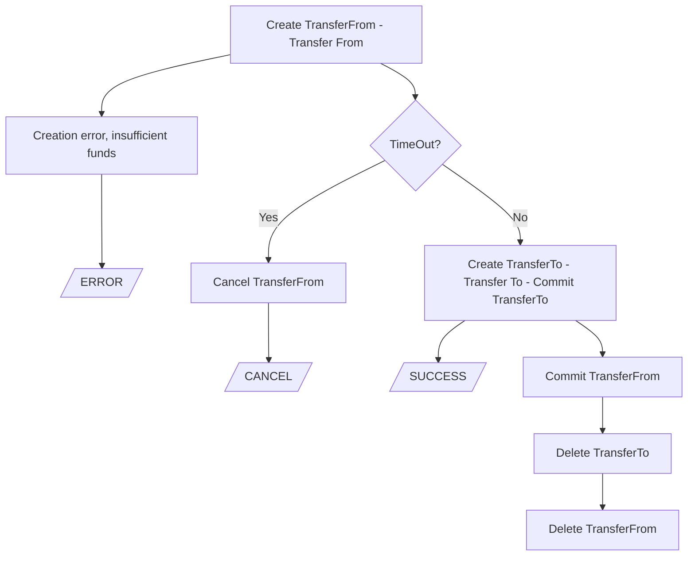

# Channel-transfer

[](https://github.com/anoideaopen/channel-transfer/actions/workflows/go.yml)
[](https://github.com/anoideaopen/channel-transfer/actions/workflows/vulnerability-scan.yml)

## TOC
- [Channel-transfer](#channel-transfer)
  - [TOC](#toc)
  - [Description](#description)
  - [Architecture](#architecture)
  - [State transitions graph](#state-transitions-graph)
  - [Open API](#open-api)
  - [Scaling](#scaling)
  - [Dependencies](#dependencies)
  - [Build](#build)
    - [Go](#go)
    - [Docker](#docker)
  - [Connection profile](#connection-profile)
  - [Run](#run)
  - [Development](#development)
    - [Utils](#utils)
    - [Protobuf](#protobuf)
    - [Code generation](#code-generation)
  - [Tests](#tests)
    - [Unit tests](#unit-tests)
    - [Integration tests](#integration-tests)
  - [Links](#links)
  - [License](#license)

## Description
Channel transfer service #channel#hlf#offchain#go#golang#transfer#asset#application#off#swap#

## Architecture

- [Design document](https://gitlab.scientificideas.org/core/application/doc/-/blob/master/design/cross_channel_transfer/index.md)
- [channel transfer chaincode API](doc/chaincodeAPI.md)
- [domain model](doc/domainModel.md)
- [channel transfer API service](doc/channelTransferApiService.md)
- [channel transfer service](doc/channelTransferService.md)
- [doc/main](doc/main.md)

## State transitions graph 



Create TransferFrom - Transfer record creating in HLF state, tokens are holding. This record will be deleted. If transfer record is missing, then either it was never created, or the transfer was successfully completed or cancelled - details should be available th the Fabric ledger.

TransferTo - must be different from TransferFrom to avoid confusion. 

"Transfer" is performed sequentially. Tokens are already held on channel FROM, which means now it's necessary to make a transfer in channel TO. When "Transfer" operation is completed, the records of TransferFrom and TransferTo will be marked accordingly. After TransferTo is completed, the result may be returned to client. Now the records should be deleted: first TransferTo, and only after that TransferFrom.

## Open API

Service provides OpenAPI(Swagger) functionality. Methods and request formats is available [here](proto/service.swagger.json)

## Scaling

Scaling not developed yet.

## Dependencies

- HLF
- Redis
- Vault (optional)

## Build

### Go
```shell
go build -ldflags="-X 'main.AppInfoVer={Version}'"
```

### Docker

## Connection profile

It is important to set reasonable timeouts in a connection profile

connection.yaml:
```yaml
name: basic-network
version: 1.0.0
client:
  organization: anoideapen

  logging:
    level: info

  connection:
    timeout:
      peer:
        endorser: '300'
      orderer: '300'

  peer:
    timeout:
      response: 5s
      connection: 3s
      discovery:
        # Expiry period for discovery service greylist filter
        # The channel client will greylist peers that are found to be offline
        # to prevent re-selecting them in subsequent retries.
        # This interval will define how long a peer is greylisted
        greylistExpiry: 1s
      registrationResponse: 10s
    orderer:
      timeout:
        connection: 3s
        response: 5s
    global:
      timeout:
        query: 5s
        execute: 5s
        resmgmt: 5s
      cache:
        connectionIdle: 30s
        eventServiceIdle: 2m
        channelConfig: 60s
        channelMembership: 10s
        
  credentialStore:
    #...
  tlsCerts:
    #...

channels:
  #...
organizations:
  #...
orderers:
  #...
peers:
  #...
```

## Run

```shell
./channel-transfer -c=config.yaml
```
or
```shell
export CHANNEL_TRANSFER_CONFIG="config.yaml" && ./channel-transfer
```
or create file ```config.yaml``` next to the channel-transfer executable\
or create file ```/etc/config.yaml```

Also, it is possible to [override](https://github.com/spf13/viper#working-with-environment-variables) values from config by env variables with `CHANNEL_TRANSFER_` prefix
```shell
export CHANNEL_TRANSFER_REDISSTOR_PASSWORD=123456 &&
export CHANNEL_TRANSFER_VAULTCRYPTOSETTINGS_VAULTAUTHPATH="v1/auth/kubernetes/login" &&
./channel-transfer -c=config.yaml
```

## Development

### Utils

```shell
protodep up
```

### Protobuf

```shell
buf generate proto -o proto 
```

### Code generation

```shell
swagger generate client -f proto/service.swagger.json -t test/integration
```

## Tests
### Unit tests

```shell
# Run unit tests
go test -count 1 -race ./...
```

### Integration tests

## Links
No

## License
Apache-2.0