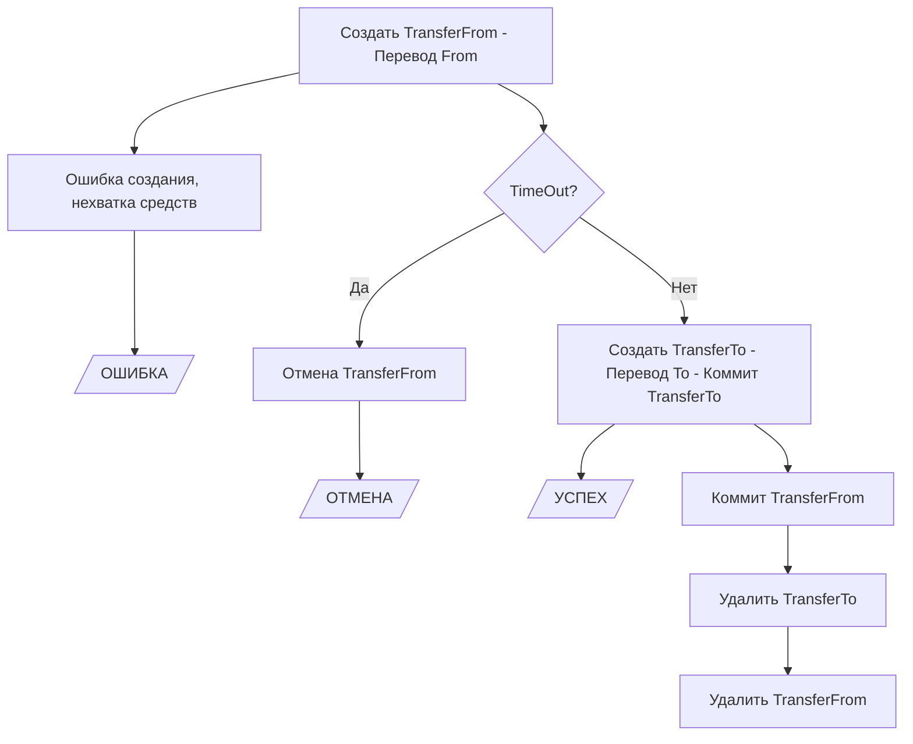

# Channel-transfer

## TOC
- [Channel-transfer](#channel-transfer)
  - [TOC](#toc)
  - [Description](#description)
  - [Architecture](#architecture)
  - [Граф переходов из состояния в состояние](#граф-переходов-из-состояния-в-состояние)
  - [Open API](#open-api)
  - [Scaling](#scaling)
  - [Dependencies](#dependencies)
  - [Build](#build)
    - [Go](#go)
    - [Docker](#docker)
  - [Connection profile](#connection-profile)
  - [Run](#run)
  - [Development](#development)
    - [Utils](#utils)
    - [Protobuf](#protobuf)
    - [Code generation](#code-generation)
  - [Tests](#tests)
    - [Unit tests](#unit-tests)
    - [Integration tests](#integration-tests)
  - [Links](#links)
  - [License](#license)

## Description
Сервис для трансферов между каналами #channel#hlf#offchain#go#golang#transfer#asset#applicatoin#off#swap#

## Architecture

- [Дизайн док](https://gitlab.scientificideas.org/core/application/doc/-/blob/master/design/cross_channel_transfer/index.md)
- [channel transfer chaincode API](doc/chaincodeAPI.md)
- [domain model](doc/domainModel.md)
- [channel transfer API service](doc/channelTransferApiService.md)
- [channel transfer service](doc/channelTransferService.md)
- [doc/main](doc/main.md)

## Граф переходов из состояния в состояние 



Создать TransferFrom - создается запись трансфера в стейте фабрики, холдируются токены. Потом эта запись будет обязательно удалена. Если этой записи нет, то либо: никогда не было, выполнено успешно или отменено (подробности должны быть в леджере фабрики).

TransferTo - должна отличаться от TransferFrom, чтобы нельзя было перепутать. 

Стадия "Перевод" производится последовательно. Токены у пользователя на канаде FROM уже захолдированы, значит главное провести перевод в канале TO. Перевод в канале FROM можем делать не торопливо. При "Переводе" в записях TransferFrom и TransferTo производятся соответствующие пометки. После TransferTo можно результат вернуть клиенту. После стадии перевод надо будет удалить записи: сначала TransferTo, и только потом TransferFrom.

## Open API

Сервис предоставляет функционал OpenAPI(Swagger). Список методов и форматов запросов доступен
по [ссылке](proto/service.swagger.json)

## Scaling

Пока масштабирование не проработано

## Dependencies

- HLF
- Redis
- Vault (optional)

## Build

### Go
```shell
go build -ldflags="-X 'main.AppInfoVer={Version}'"
```

### Docker

## Connection profile

It is important to set reasonable timeouts in a connection profile

connection.yaml:
```yaml
name: basic-network
version: 1.0.0
client:
  organization: anoideapen

  logging:
    level: info

  connection:
    timeout:
      peer:
        endorser: '300'
      orderer: '300'

  peer:
    timeout:
      response: 5s
      connection: 3s
      discovery:
        # Expiry period for discovery service greylist filter
        # The channel client will greylist peers that are found to be offline
        # to prevent re-selecting them in subsequent retries.
        # This interval will define how long a peer is greylisted
        greylistExpiry: 1s
      registrationResponse: 10s
    orderer:
      timeout:
        connection: 3s
        response: 5s
    global:
      timeout:
        query: 5s
        execute: 5s
        resmgmt: 5s
      cache:
        connectionIdle: 30s
        eventServiceIdle: 2m
        channelConfig: 60s
        channelMembership: 10s
        
  credentialStore:
    #...
  tlsCerts:
    #...

channels:
  #...
organizations:
  #...
orderers:
  #...
peers:
  #...
```

## Run

```shell
./channel-transfer -c=config.yaml
```
or
```shell
export CHANNEL_TRANSFER_CONFIG="config.yaml" && ./channel-transfer
```
or create file ```config.yaml``` next to the channel-transfer executable\
or create file ```/etc/config.yaml```

Also, it is possible to [override](https://github.com/spf13/viper#working-with-environment-variables) values from config by env variables with `CHANNEL_TRANSFER_` prefix
```shell
export CHANNEL_TRANSFER_REDISSTOR_PASSWORD=123456 &&
export CHANNEL_TRANSFER_VAULTCRYPTOSETTINGS_VAULTAUTHPATH="v1/auth/kubernetes/login" &&
./channel-transfer -c=config.yaml
```

## Development

### Utils

```shell
protodep up
```

### Protobuf

```shell
buf generate proto -o proto 
```

### Code generation

```shell
swagger generate client -f proto/service.swagger.json -t test/integration
```

## Tests
### Unit tests

```shell
# Run unit tests
go test -count 1 -race ./...
```

### Integration tests

## Links
No

## License
Apache-2.0