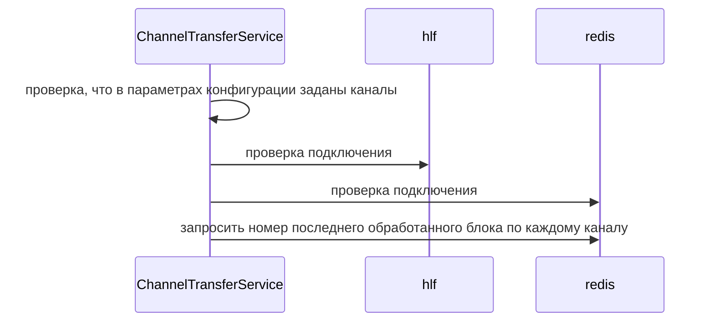
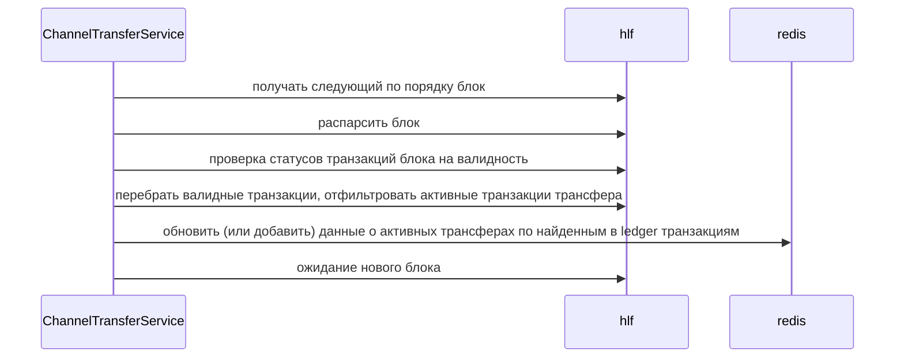
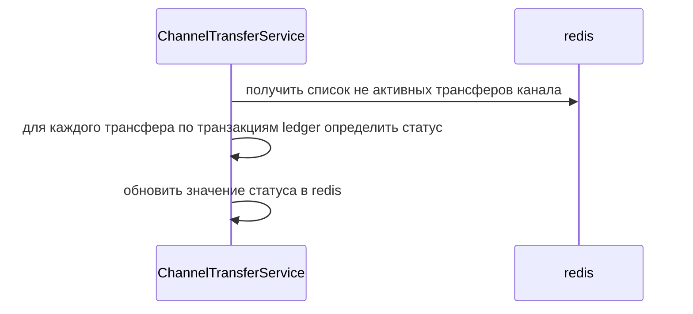
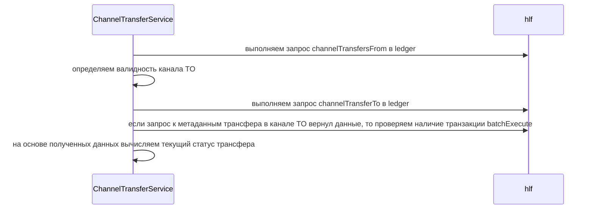
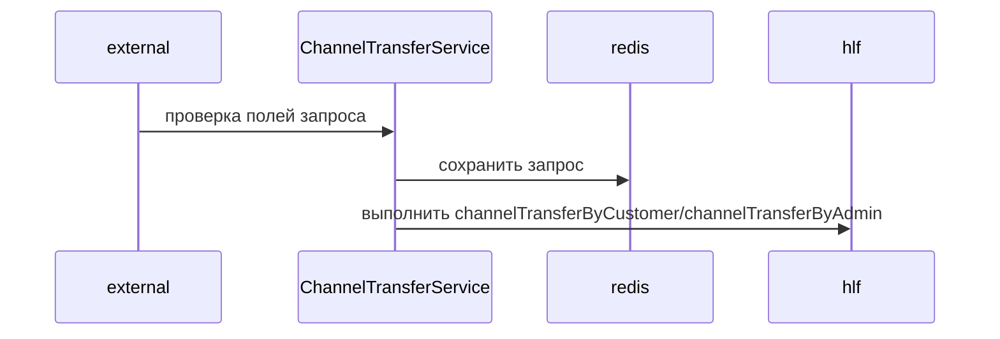
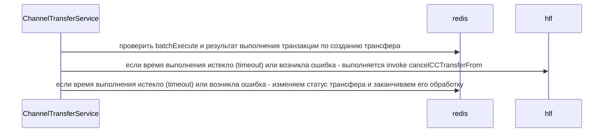
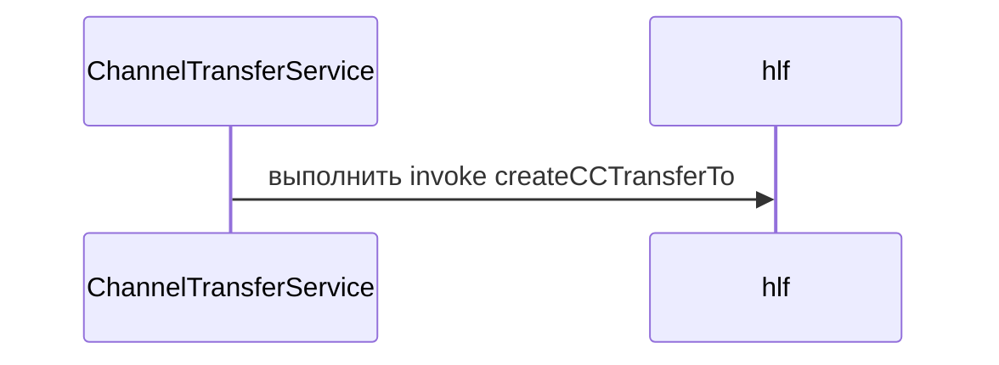
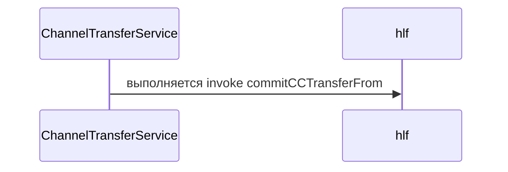
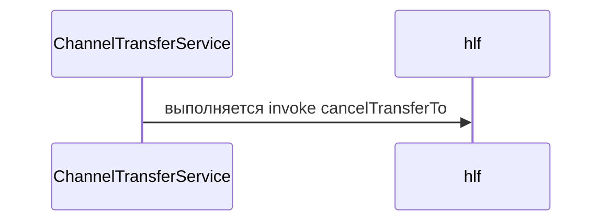
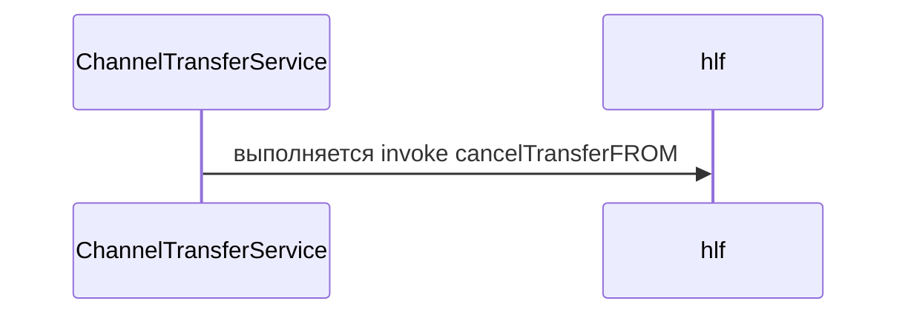

## Описание сервиса 

### Инициализация сервиса

### Подписка на блоки ledger

Получаем данные из ledger по всем каналам, заданным в конфигурации сервиса и найденным в параметре TO трансферов, и актуализируем данные в redis. 
Сканирование каналов ledger начинается или с нулевого блока, или с последнего проанализированного сервисом блока,
информация о котором автоматически сохраняется в redis. 

###  Синхронизация статусов трансферов в redis с ledger для каждого канала

Процесс проверки выполнения транзакций переводов и актуализации статусов в redis

### Определение статуса трансфера

Процесс вычисляет текущий статус трансфера на основе данных ledger 

### Обработка запроса к API на создание трансфера. 1 часть

### Завершение 1-й части трансфера - проверка batchExecute в канале FROM

### Создание 2-й части трансфера - перевод в канал TO

### Завершение 2-й части трансфера - проверка batchExecute в канале TO

### 3-я часть трансфера - выставляем признак 2-й фазы

### 4-я часть трансфера - удалить метаданные трансфера в канале TO

### 5-я часть трансфера - удалить метаданные трансфера в канале FROM

