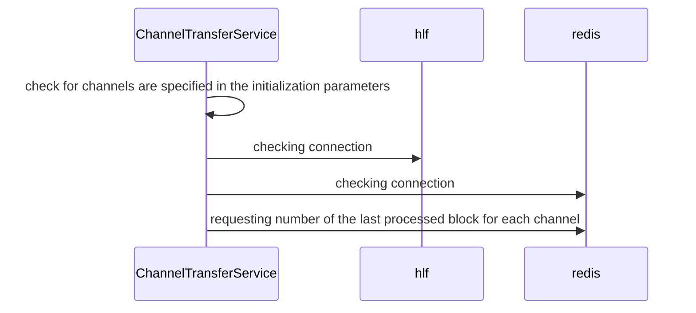
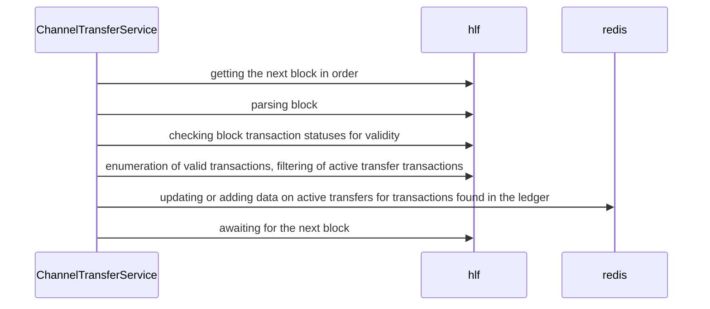
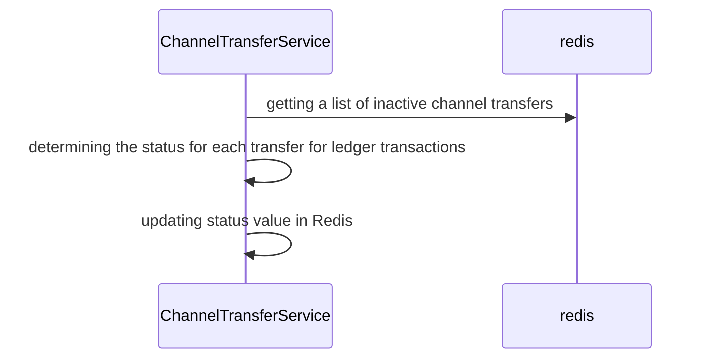
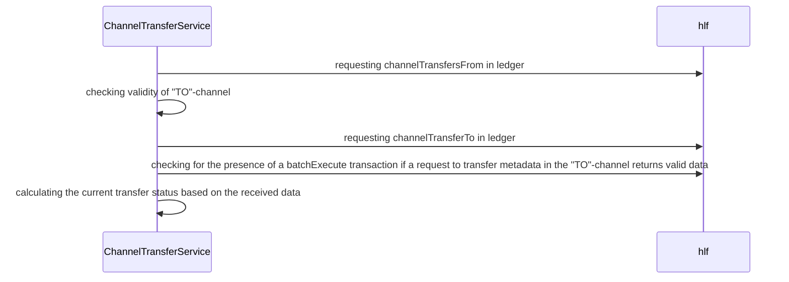
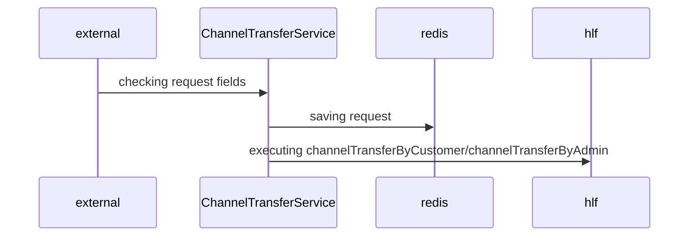
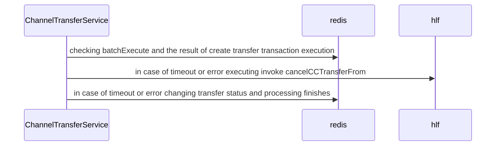
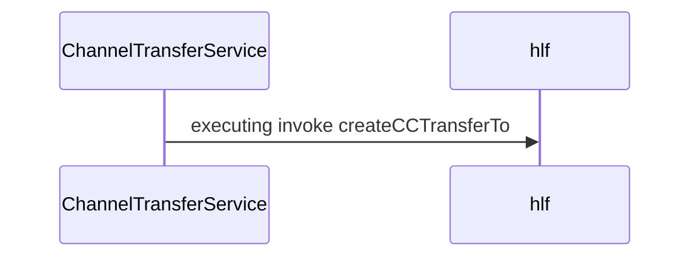
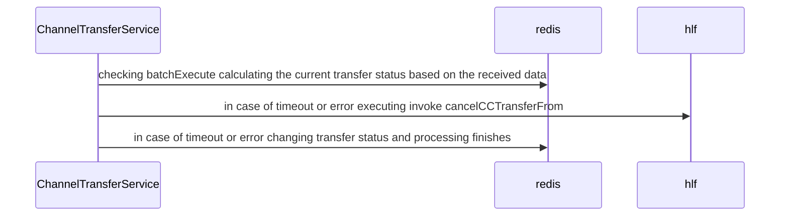
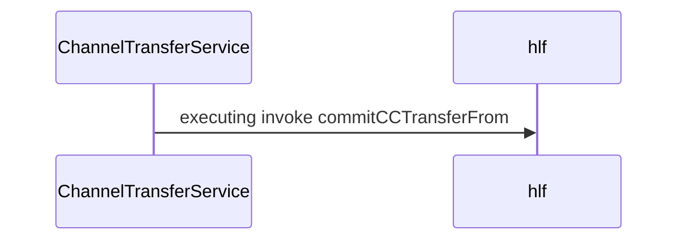
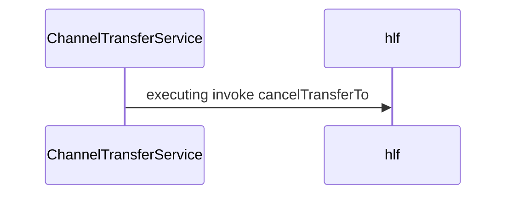

## Service description 

### Service initialization

### Subscription to ledger blocks

Receiving data from ledger through all channels specified in the service configuration parameters and found specified in the “TO” transfers parameter, updating data in Redis. 
Ledger channel scanning starts from the zero block or from the last block analyzed by the service, information about which is automatically saved in Redis. 

###  Syncing transfer statuses in redis with ledger for each channel

Checking the completion of transfer transactions and updating statuses in Redis

### Determining transfer status

Calculating current transfer status basing on ledger data

### Processing transfer's 1st stage - requesting to the API for transfer creation

### Completion of transfer's 1st stage - checking batchExecute in the "FROM"-channel

### Processing transfer's 2nd stage - transferring to "TO"-channel

### Completion of transfer's 2nd stage - checking batchExecute in the "TO"-channel

### Processing transfer's 3rd stage - setting the 2nd phase sign

### Processing transfer's 4th stage - deleting transfer metadata in "TO"-channel

### Processing transfer's 5th stage - deleting transfer metadata in "FROM"-channel

